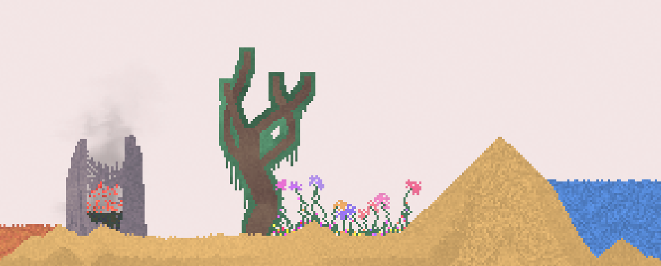

<meta charset="utf-8"/>

# sandspiel

"Imagine the cool phenomenon when the wind blows the falling leaves. This game simulates the phenomenon with powder (dots)!" -DAN-BALL



This is a [falling sand](https://en.wikipedia.org/wiki/Falling-sand_game) game built in rust (via wasm), webgl, and some JS glueing things together.

You can [play online](https://sandspiel.club) or read [a longer post on the project](https://maxbittker.com/making-sandspiel)

The goal was to produce an cellular automata environment that's interesting to play with and supports the sharing and forking of fun creations with other players.
Ultimately, I want the platform to support editing and uploading of your own elements via a programmable cellular automata API.

### 🛠️ Build:

```
# build the wasm once:
cd crate && wasm-pack build && cd ..;
npm install;
npm run start;

# then in a separate terminal:
cargo watch -s 'wasm-pack build'
```

### 📦 Production build — static `dist/` from scratch

Produces a self-contained static site in `dist/` that can be served from any
static host / CDN (S3, etc.) with no server.

**1. Install the toolchain** (one time). You need Node.js plus the Rust → wasm
toolchain (`npm run build` compiles the Rust crate via `wasm-pack`):

```
# Rust toolchain + wasm-pack (macOS / Homebrew)
brew install rustup wasm-pack
rustup default stable
rustup target add wasm32-unknown-unknown

# (any OS, without Homebrew: install rustup from https://rustup.rs, then)
# cargo install wasm-pack
# rustup target add wasm32-unknown-unknown
```

Make sure `cargo` / `wasm-pack` are on your `PATH` (Homebrew's rustup is
keg-only, so add it for the current shell):

```
export PATH="$(brew --prefix rustup)/bin:$HOME/.cargo/bin:$PATH"
```

**2. Install JS dependencies** (the repo's `.npmrc` sets `legacy-peer-deps`, so
plain `npm install` works):

```
npm install            # or: npm install --legacy-peer-deps
```

**3. Build the static site:**

```
npm run build          # webpack --mode=production -> writes ./dist
```

`dist/` now contains `index.html`, the JS bundles, the optimized `*.module.wasm`,
`assets/`, and `styles.css`. All paths are relative, so it works at the CDN root
or any sub-folder.

**Preview it locally** (no server code needed):

```
npx http-server dist -a 127.0.0.1 -p 8090
# open http://127.0.0.1:8090/
```

**Deploy to S3 + CDN:** upload the *contents* of `dist/`, then make sure the
`.wasm` object is served as `application/wasm` (S3 mislabels it otherwise; the
app still works via a slower fallback, but this is faster):

```
aws s3 sync dist/ s3://YOUR_BUCKET/ --delete
aws s3 cp s3://YOUR_BUCKET/ s3://YOUR_BUCKET/ --recursive --exclude "*" \
  --include "*.module.wasm" --content-type "application/wasm" \
  --metadata-directive REPLACE
```

a successor to my previous efforts in [javascript](https://github.com/MaxBittker/dust) and [lua](https://github.com/MaxBittker/sand-toy)

Fluid simulation code adopted from
https://github.com/PavelDoGreat/WebGL-Fluid-Simulation
